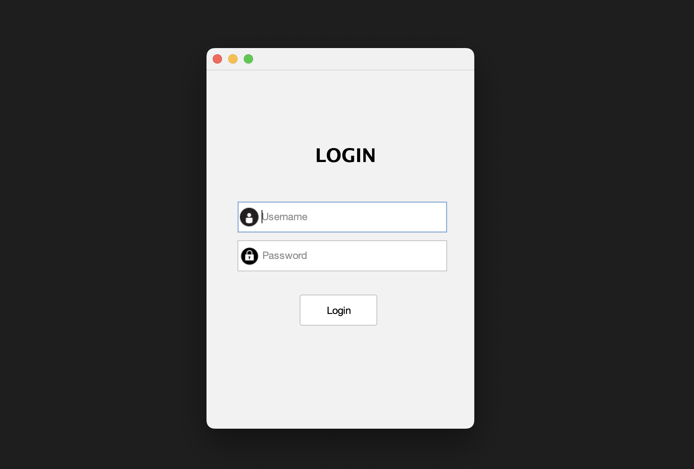
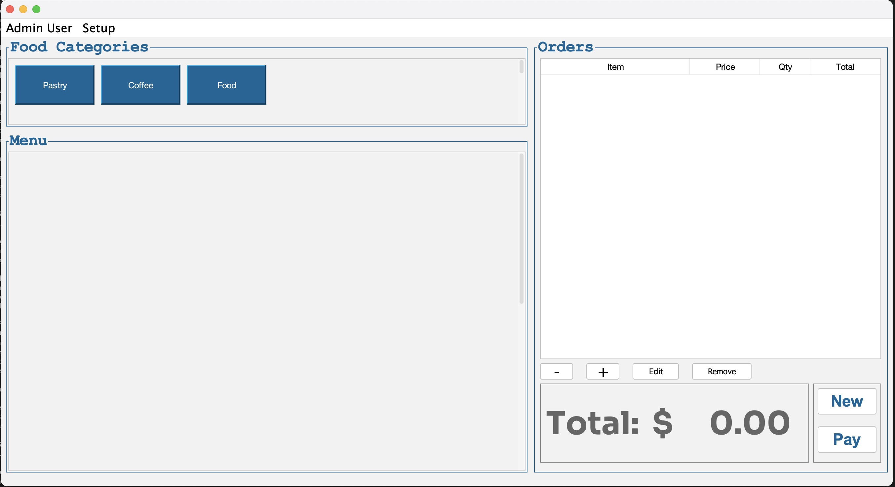
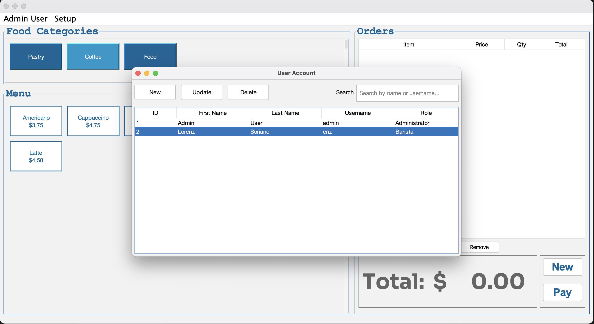
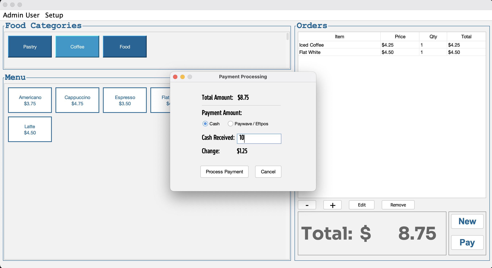

# ☕ Cafe Management System

A comprehensive Java-based cafe management system with user management, menu operations, order processing, and payment handling.

**Authors:** Lorenz Soriano (18011129) & Phoebe Cruz (21143576)  
**Course:** COMP603 - Program Design and Construction  
**University:** AUT - Auckland University of Technology

[](https://openjdk.org/)
[](https://maven.apache.org/)
[](https://db.apache.org/derby/)
[](#)

---

## 🚀 Quick Start

### Option 1: Run Executable (Recommended)
```bash
# Build the executable
mvn clean package

# Run with launcher scripts
./run-cafe.sh          # macOS/Linux
run-cafe.bat           # Windows

# Or run directly
java -jar target/CafeInventorySystem-1.0-SNAPSHOT-executable.jar
```

### Option 2: Development Mode
```bash
# Compile and run from source
mvn clean compile exec:java
```

**Login Credentials:**
- **Admin:** `admin` / `admin123` (Full access)
- **Staff:** `enz` / `whoyou123` (Menu operations)

---

## 📋 Features

### 🔐 Authentication & User Management
- **Secure Login System** with role-based access control
- **Complete CRUD Operations** for user accounts
- **Photo Upload** functionality with automatic file management
- **Form Validation** with placeholder text and error handling
- **Sequential ID Generation** for proper user organization

### 🍽️ Menu & Order Management  
- **Dynamic Menu Loading** from database with category organization
- **Real-time Order Processing** with shopping cart functionality
- **Inventory Tracking** and menu item availability
- **Category-based Menu Display** with intuitive navigation

### 💳 Payment & Receipt System
- **Multiple Payment Methods** (Cash and EFTPOS/Paywave)
- **Automatic Receipt Generation** with detailed order information
- **Change Calculation** for cash transactions
- **Receipt Storage** in organized file structure

### 🗄️ Database Integration
- **Embedded Derby Database** with automatic initialization
- **DAO Pattern Implementation** for clean data access
- **Connection Management** with proper resource handling
- **Database Schema** auto-creation and migration

---

## 🏗️ System Architecture

```
src/
├── main/
│   ├── java/com/cafe/
│   │   ├── CafeApp.java                 # Main application entry point
│   │   ├── CafeController.java          # Application controller
│   │   ├── dao/                         # Data Access Objects
│   │   │   ├── UserAccountDAO*.java     # User management data access
│   │   │   ├── MenuItemDAO*.java        # Menu data access
│   │   │   ├── PaymentDAO*.java         # Payment data access
│   │   │   └── RoleDAO*.java            # Role management data access
│   │   ├── db/
│   │   │   ├── Database.java            # Connection management
│   │   │   └── TestDatabase.java        # Database testing utilities
│   │   ├── gui/
│   │   │   ├── CafeMain.java            # Main application window
│   │   │   ├── LoginFrame.java          # Authentication interface
│   │   │   └── dialogs/                 # Modal dialogs
│   │   │       ├── UserAccDialog*.java  # User management dialogs
│   │   │       └── PaymentDialog.java   # Payment processing dialog
│   │   ├── model/                       # Data models
│   │   │   ├── UserAccount.java         # User entity
│   │   │   ├── Role.java                # Role entity
│   │   │   ├── MenuItem.java            # Menu item entity
│   │   │   ├── Payment.java             # Payment entity
│   │   │   └── Receipt.java             # Receipt entity
│   │   └── service/
│   │       └── ReceiptService.java      # Receipt generation service
│   └── resources/
│       ├── init_db.sql                  # Database schema
│       ├── images/                      # User photos and UI icons
│       └── icons/                       # Application icons
```

---

## 🛠️ Technical Details

### Technologies Used
- **Java 21+** - Core programming language
- **Maven** - Build automation and dependency management
- **Apache Derby** - Embedded database
- **Java Swing** - GUI framework
- **FlatLaf** - Modern look and feel

### Design Patterns
- **DAO Pattern** - Data access abstraction
- **Singleton Pattern** - Database connection management
- **Observer Pattern** - GUI event handling
- **Factory Pattern** - Object creation

### Key Dependencies
```xml
<dependency>
    <groupId>org.apache.derby</groupId>
    <artifactId>derby</artifactId>
    <version>10.17.1.0</version>
</dependency>
<dependency>
    <groupId>com.formdev</groupId>
    <artifactId>flatlaf</artifactId>
    <version>3.2.5</version>
</dependency>
```

---

## 📱 Screenshots

### Login Interface
Clean, professional login screen with credential validation.



### Main Dashboard
Intuitive menu layout with category navigation and order management.



### User Management
Comprehensive user administration with photo upload capabilities.




### Payment Processing
Streamlined payment interface with receipt generation.


---

## 🔧 Installation & Setup

### Prerequisites
- **Java Development Kit (JDK) 21 or later**
- **Maven 3.6 or later**
- **Git** (for cloning)

### Installation Steps

1. **Clone the Repository**
   ```bash
   git clone https://github.com/Jlowkee19/comp603-pdc-project2.git
   cd comp603-pdc-project2
   ```

2. **Build the Project**
   ```bash
   mvn clean compile package
   ```

3. **Run the Application**
   ```bash
   # Using launcher scripts (recommended)
   ./run-cafe.sh              # macOS/Linux
   run-cafe.bat               # Windows
   
   # Or directly
   java -jar target/CafeInventorySystem-1.0-SNAPSHOT-executable.jar
   ```

### System Requirements
- **OS:** Windows 10+, macOS 10.14+, Linux (Ubuntu 18.04+)
- **RAM:** 512MB minimum, 1GB+ recommended
- **Disk Space:** 200MB for application and data
- **Display:** 1024x768 minimum, 1920x1080 recommended

---

## 💾 Database Schema

### Core Tables
- **`user_account`** - User information and authentication
- **`role`** - User roles and permissions
- **`menu_items`** - Cafe menu with categories and pricing
- **`payments`** - Transaction records and payment methods

### Auto-Initialization
The database automatically creates tables and inserts default data on first run:
- Default admin and staff accounts
- Sample menu items across multiple categories
- Role definitions for access control

---

## 🧪 Testing

### Running Tests
```bash
# Run all tests
mvn test

# Run specific test classes
mvn test -Dtest=PaymentDialogTest
```

### Manual Testing Checklist
- [ ] Login with admin and staff credentials
- [ ] Create, read, update, delete users
- [ ] Upload and display user photos
- [ ] Process orders and payments
- [ ] Generate and verify receipts
- [ ] Test form validation and error handling

---

## 📁 Project Structure

```
comp603-pdc-project2/
├── 📄 README.md                    # This file
├── 📄 EXECUTABLE_README.md         # Executable distribution guide
├── 📄 PROJECT_REPORT.md            # Academic project report
├── 📄 VIDEO_DEMO_SCRIPT.md         # Video demonstration script
├── 📄 pom.xml                      # Maven configuration
├── 📄 .gitignore                   # Git ignore rules
├── 🔧 run-cafe.sh                  # Unix launcher script
├── 🔧 run-cafe.bat                 # Windows launcher script
├── 📁 src/                         # Source code
├── 📁 target/                      # Build artifacts (generated)
├── 📁 cafeDB/                      # Database files (generated)
└── 📁 receipts/                    # Generated receipts (runtime)
```

---

## 🚀 Deployment

### Distribution Options

1. **Standalone JAR** (Recommended)
   - Single 13MB file with all dependencies
   - Platform-independent
   - No installation required

2. **Source Distribution**
   - Full project with source code
   - Requires Java development environment
   - Allows customization and development

3. **Native Executable** (Future Enhancement)
   - Platform-specific binaries
   - No Java runtime required
   - Faster startup time

---

## 🔍 Troubleshooting

### Common Issues

**"Java is not installed"**
- Install Java 21+ from [Oracle](https://www.oracle.com/java/technologies/downloads/) or [OpenJDK](https://openjdk.org/)

**"Database connection failed"**
- Ensure write permissions in project directory
- Check that Derby database files can be created

**"GUI not displaying correctly"**
- Verify Java version compatibility
- Try different system look-and-feel settings

**"Login fails with correct credentials"**
- Delete `cafeDB` folder and restart (will recreate database)
- Check for special characters in credentials

### Performance Optimization
- **Memory:** Increase heap size with `-Xmx512m` for large datasets
- **Database:** Regular cleanup of old receipts and logs
- **Images:** Compress user photos before upload

---

## 🤝 Contributing

This is an academic project, but we welcome feedback and suggestions:

1. **Fork** the repository
2. **Create** a feature branch
3. **Commit** your changes
4. **Push** to the branch
5. **Create** a Pull Request

### Development Guidelines
- Follow existing code style and patterns
- Add comprehensive comments for complex logic
- Include unit tests for new features
- Update documentation for API changes

---

## 📝 License & Academic Use

This project is developed for academic purposes as part of COMP603 coursework at Auckland University of Technology. 

**Academic Integrity Notice:** This code is provided for reference and learning purposes. Students should not copy this work directly for their own assignments.

---

## 👥 Team Members

| Name | ID | Responsibilities | Contact |
|------|----|--------------------|---------|
| **Lorenz Soriano** | 18011129 | Database, Core Framework, Payment System | xvq7775@autuni.ac.nz |
| **Phoebe Cruz** | 21143576 | User Management, GUI, Photo Upload | tfs0091@autuni.ac.nz |

---

## 📞 Support

For questions, issues, or feedback:

- **GitHub Issues:** [Create an issue](https://github.com/Jlowkee19/comp603-pdc-project2/issues)
- **Email:** Contact team members directly
- **Documentation:** Check `EXECUTABLE_README.md` for detailed usage instructions

---

## 🏆 Acknowledgments

- **Auckland Univesity of Technology** - COMP603 Course Structure
- **Apache Software Foundation** - Derby Database
- **FormDev** - FlatLaf Look and Feel
- **Open Source Community** - Various libraries and tools

---

**⭐ If you find this project helpful, please give it a star!**

*Last updated: June 15, 2025*